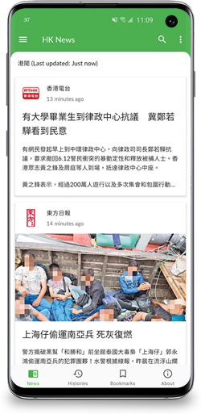
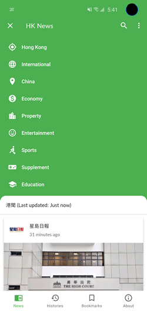

HK News Android
===============

Serves aggregated news from 10+ local news publishers in Hong Kong. Made with ❤

  

## Features
* Read news from 10 local news publishers
* Support video news
* Bookmarks and reading history
* Deep-learning based smart image cropping
* Support dark mode in Android Q
* No ads. We hate ads as much as you do

## News Publishers
* [Apple Daily (蘋果日報)](http://hk.apple.nextmedia.com)
* [Oriental Daily (東方日報)](http://orientaldaily.on.cc)
* [Sing Tao (星島日報)](http://std.stheadline.com)1
* [Hong Kong Economic Times (經濟日報)](http://www.hket.com)2
* [Sing Pao (成報)](https://www.singpao.com.hk)
* [Ming Pao (明報)](http://www.mingpao.com)
* [Headline (頭條日報)](http://hd.stheadline.com)1
* [Sky Post (晴報)](http://skypost.ulifestyle.com.hk)
* [Hong Kong Economic Journal (信報)](http://www.hkej.com)
* [RTHK (香港電台)](http://news.rthk.hk)
* [South China Morning Post (南華早報)](http://www.scmp.com/frontpage/hk)3
* [The Standard (英文虎報)](http://www.thestandard.com.hk)
* [Wen Wei Po (文匯報)](http://news.wenweipo.com)

###### Notes
1. Scrapping might be blocked by their servers
2. Full news details may be available to members only
3. Topics section cannot be parsed correctly

## HK News Backend
[hknews-backend](https://github.com/ayltai/hknews-backend)

## HK News Infrastructure
[hknews-infrastructure](https://github.com/ayltai/hknews-infrastructure)

## Requirements
This app supports Android 4.4 Jelly Bean (API 19) or later.

## Acknowledgements
This app is made with the support of open source projects:

* [Realm](https://realm.io/news/realm-for-android)
* [RxJava](https://github.com/ReactiveX/RxJava)
* [RxAndroid](https://github.com/ReactiveX/RxAndroid)
* [RxJava2Debug](https://github.com/akaita/RxJava2Debug)
* [Dagger 2](https://google.github.io/dagger)
* [Glimpse](https://github.com/the-super-toys/glimpse-android)
* [TensorFlow Lite](https://www.tensorflow.org/lite)
* [Facebook Fresco](https://github.com/facebook/fresco)
* [FrescoImageViewer](https://github.com/stfalcon-studio/FrescoImageViewer)
* [Subsampling Scale Image View](https://github.com/davemorrissey/subsampling-scale-image-view)
* [BigImageViewer](https://github.com/Piasy/BigImageViewer)
* [Material SearchBar](https://github.com/mancj/MaterialSearchBar)
* [ExoPlayer](https://github.com/google/ExoPlayer)
* [ShimmerLayout](https://github.com/team-supercharge/ShimmerLayout)
* [SmallBang](https://github.com/hanks-zyh/SmallBang)
* [Retrofit](https://github.com/square/retrofit)
* [OkHttp](https://github.com/square/okhttp)
* [Apache Commons Lang3](https://commons.apache.org/proper/commons-lang/)
* [Calligraphy](https://github.com/InflationX/Calligraphy)
* [AutoValue](https://github.com/google/auto/tree/master/value)
* [Gson](https://github.com/google/gson)
* [Espresso](https://google.github.io/android-testing-support-library)
* [JUnit 4](https://github.com/junit-team/junit4)
* [Mockito](https://github.com/mockito/mockito)
* [PowerMock](https://github.com/powermock/powermock)
* [Robolectric](http://robolectric.org)
* [LeakCanary](https://github.com/square/leakcanary)
* [Dexcount Gradle Plugin](https://github.com/KeepSafe/dexcount-gradle-plugin)

… and closed source services:

* [Firebase Remote Config](https://firebase.google.com/docs/remote-config)
* [Firebase Performance Monitoring](https://firebase.google.com/docs/perf-mon)
* [Google Analytics for Firebase](https://firebase.google.com/docs/analytics)
* [CircleCI](https://circleci.com)
* [Fabric Crashlytics](https://fabric.io/kits/android/crashlytics)
